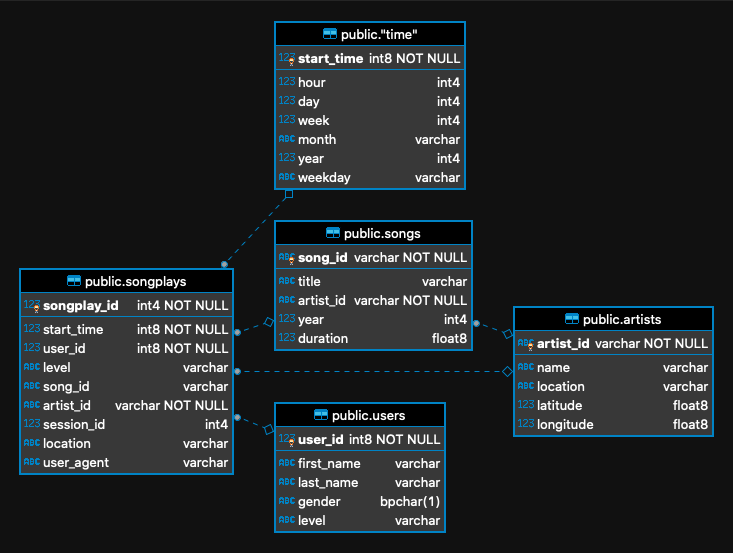

# Project description
This project was created to help a startup called Sparkify. They have a music streaming app and want to understand what songs users are listening to. They don't have an easy way to query their data, which resides in a directory of JSON logs on user activity on the app, as well as a directory with JSON metadata on the songs in their app.

To help Sparkify to understand their data, we create an ETL process to extract and transform the logs and store them on a Postgres database, where we can aggregate information in an easy way and understand what users are listening to.

## Project structure

We have a file called `sql_queries.py` with all SQL Queries used in the project, a file called `create_tables.py` that start/restart the database structure on postgres, and a file called `etl.py` that execute the process of read all files and migrate their data in a strucured way for our database.

## Running the project

To run this project, we need to execute in order:
```
python create_tables.py
```
to create the base strucure, and 
```
python etl.py
```
to execute the migration process.

## Example queries

This is the final strucure created for Sparkify:



Now we can know what song a user listen, where they are and when they listen the song. We can get details of song like artist, duration etc.

On example below we get the informations about users that listen a song in our library, where they are, what song they listen and the date they do it.

```
SELECT 
	u.first_name,
	u.last_name,
	s2.title,
	t.year,
	t.month,
	t.day,
	t.hour,
	s."location" 
FROM songplays s
JOIN users u ON u.user_id = s.user_id
JOIN "time" t ON t.start_time = s.start_time 
JOIN songs s2 ON s2.song_id  = s.song_id 
JOIN artists a ON a.artist_id = s.artist_id 
WHERE s.song_id IS NOT NULL
```

Or for example how many times users played some song in a year:

```
SELECT t.year, count(1) FROM songplays s 
JOIN "time" t ON t.start_time = s.start_time 
GROUP BY t.year;
```